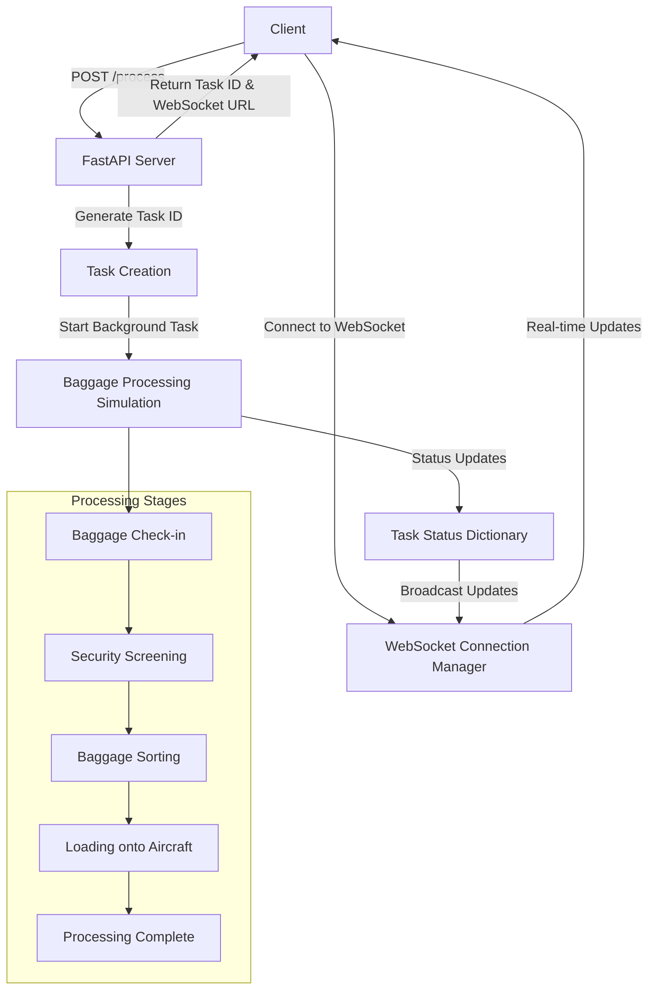

# 🛫 AirlineFlowWSTest - Real-time Baggage Processing System

A FastAPI-based WebSocket application that simulates real-time airline baggage processing with live status updates. This project demonstrates the implementation of WebSocket connections for real-time communication between server and client.

## 📋 Table of Contents

- [Overview](#overview)
- [Features](#features)
- [Technology Stack](#technology-stack)
- [System Architecture](#system-architecture)
- [Understanding WebSockets vs API Polling](#understanding-websockets-vs-api-polling)
- [Project Structure](#project-structure)
- [Installation](#installation)
- [Usage](#usage)
- [API Endpoints](#api-endpoints)
- [WebSocket Events](#websocket-events)
- [Deployment](#deployment)
- [Contributing](#contributing)

## 🔍 Overview

This application simulates an airline baggage processing system that tracks baggage through various stages from check-in to aircraft loading. It uses WebSocket technology to provide real-time updates to connected clients about the processing status.

### Key Components:
- **FastAPI Backend**: Handles HTTP requests and WebSocket connections
- **WebSocket Manager**: Manages multiple concurrent WebSocket connections
- **Task Simulation**: Simulates baggage processing with realistic timing
- **Real-time Updates**: Broadcasts status changes to all connected clients

## ✨ Features

- 🔄 **Real-time Status Updates**: Live baggage processing status via WebSockets
- 🎯 **Multi-client Support**: Multiple clients can track the same baggage
- 📊 **Progress Tracking**: Visual progress indication through processing stages
- 🏷️ **Unique Task IDs**: Each baggage processing task has a unique identifier
- 🔄 **Automatic Reconnection**: Robust connection handling with error recovery
- 📱 **RESTful API**: HTTP endpoints for task creation and status checking
- 🎨 **Interactive Dashboard**: Beautiful HTML interface for status monitoring

## 🛠️ Technology Stack

- **Backend Framework**: FastAPI 0.104.1
- **WebSocket Library**: Native FastAPI WebSocket support
- **ASGI Server**: Uvicorn with standard extras
- **Language**: Python 3.11+
- **Frontend**: HTML5, CSS3, JavaScript (WebSocket API)
- **Containerization**: Docker
- **CI/CD**: GitHub Actions

## 🏗️ System Architecture

```
┌─────────────────┐    HTTP POST     ┌──────────────────┐
│   Client Apps   │ ───────────────► │   FastAPI App    │
│                 │                  │                  │
│  ┌───────────┐  │    WebSocket     │  ┌─────────────┐ │
│  │Dashboard 1│  │ ◄──────────────► │  │ Connection  │ │
│  └───────────┘  │    Connection    │  │  Manager    │ │
│  ┌───────────┐  │                  │  └─────────────┘ │
│  │Dashboard 2│  │ ◄──────────────► │                  │
│  └───────────┘  │                  │  ┌─────────────┐ │
│  ┌───────────┐  │                  │  │   Task      │ │
│  │Dashboard N│  │ ◄──────────────► │  │ Processing  │ │
│  └───────────┘  │                  │  │  Engine     │ │
└─────────────────┘                  │  └─────────────┘ │
                                     └──────────────────┘
```

### Data Flow Diagram



## 🔄 Understanding WebSockets vs API Polling

### Traditional API Polling Approach

In traditional web applications, clients need to repeatedly request server updates:

```
Client                    Server
  │                        │
  │─────── GET /status ────►│
  │◄──── Response Data ────│
  │                        │
  │─ Wait (e.g., 5 seconds)─│
  │                        │
  │─────── GET /status ────►│
  │◄──── Response Data ────│
  │                        │
  └─ Repeat every N seconds─┘
```

**Drawbacks of API Polling:**
- ⚡ **High Latency**: Updates delayed by polling interval
- 🔄 **Resource Wasteful**: Many unnecessary requests when no updates
- 📊 **Poor UX**: Choppy, non-real-time experience
- 💸 **High Server Load**: Constant HTTP requests consume resources

### WebSocket Approach

WebSockets provide a persistent, bidirectional connection:

```
Client                    Server
  │                        │
  │──── WebSocket Handshake ─────►│
  │◄─── Connection Established ───│
  │                        │
  │◄──── Live Update 1 ────│
  │◄──── Live Update 2 ────│
  │◄──── Live Update 3 ────│
  │                        │
  └── Persistent Connection ─┘
```

**Benefits of WebSockets:**
- ⚡ **Real-time Updates**: Instant data push from server
- 🚀 **Efficient**: No repeated handshakes or headers
- 📱 **Better UX**: Smooth, live updates
- 💰 **Cost-effective**: Lower server resource usage

### Performance Comparison

| Aspect | API Polling | WebSockets |
|--------|-------------|------------|
| **Latency** | High (polling interval) | Near-zero |
| **Server Load** | High (constant requests) | Low (persistent connection) |
| **Network Overhead** | High (HTTP headers) | Low (minimal frame overhead) |
| **Real-time Experience** | Poor | Excellent |
| **Complexity** | Simple | Moderate |

## 📁 Project Structure

```
AirlineFlowWSTest/
├── app.py                 # Main FastAPI application
├── templates/             # HTML templates
│   └── weather_dashboard.html
├── requirements.txt       # Python dependencies
├── Dockerfile            # Container configuration
├── .gitignore           # Git ignore rules
├── .github/
│   └── workflows/
│       └── ci_cd.yml    # GitHub Actions CI/CD
└── README.md           # Project documentation
```

## 🚀 Installation

### Prerequisites

- Python 3.11 or higher
- pip package manager
- Git

### Local Development Setup

1. **Clone the repository:**
   ```bash
   git clone https://github.com/yourusername/AirlineFlowWSTest.git
   cd AirlineFlowWSTest
   ```

2. **Create virtual environment:**
   ```bash
   python -m venv envAirlineWS
   
   # Windows
   envAirlineWS\Scripts\activate
   
   # macOS/Linux
   source envAirlineWS/bin/activate
   ```

3. **Install dependencies:**
   ```bash
   pip install -r requirements.txt
   ```

4. **Run the application:**
   ```bash
   uvicorn app:app --reload --port 7000
   ```

5. **Access the application:**
   - API: http://localhost:7000
   - Documentation: http://localhost:7000/docs

### Docker Setup

1. **Build the Docker image:**
   ```bash
   docker build -t airlineflowws .
   ```

2. **Run the container:**
   ```bash
   docker run -p 8000:8000 airlineflowws
   ```

## 📖 Usage

### Starting a Baggage Processing Task

1. **Create a new processing task:**
   ```bash
   curl -X POST http://localhost:7000/process
   ```

   **Response:**
   ```json
   {
     "task_id": "123e4567-e89b-12d3-a456-426614174000",
     "message": "Baggage processing started",
     "websocket_url": "/ws/status/123e4567-e89b-12d3-a456-426614174000",
     "instruction": "Connect to the WebSocket URL to receive real-time status updates"
   }
   ```

2. **Connect to WebSocket for real-time updates:**
   ```javascript
   const ws = new WebSocket('ws://localhost:7000/ws/status/123e4567-e89b-12d3-a456-426614174000');
   
   ws.onmessage = function(event) {
     const data = JSON.parse(event.data);
     console.log('Status Update:', data);
   };
   ```

### Processing Stages

The baggage processing simulation goes through these stages:

1. **Baggage Check-in** (20-30 seconds)
2. **Security Screening** (25-35 seconds)
3. **Baggage Sorting** (20-30 seconds)
4. **Loading onto Aircraft** (25-35 seconds)
5. **Processing Complete**

## 🌐 API Endpoints

### HTTP Endpoints

| Method | Endpoint | Description | Response |
|--------|----------|-------------|----------|
| `GET` | `/` | Root endpoint | Welcome message |
| `POST` | `/process` | Start new baggage processing | Task ID and WebSocket URL |
| `GET` | `/status/{task_id}` | Get current task status (HTTP fallback) | Task status object |

### WebSocket Endpoints

| Endpoint | Description |
|----------|-------------|
| `/ws/status/{task_id}` | Real-time status updates for specific task |

## 📡 WebSocket Events

### Connection Events

- **Connection Established**: Client receives immediate current status
- **Status Updates**: Real-time processing stage updates
- **Error Handling**: Automatic reconnection on connection loss
- **Disconnection**: Clean removal from connection pool

### Message Format

```json
{
  "task_id": "123e4567-e89b-12d3-a456-426614174000",
  "stage": 2,
  "stage_name": "Baggage Sorting",
  "progress": 50,
  "status": "Processing",
  "start_time": "2024-01-15T10:30:00.000Z",
  "estimated_completion": 1705320720,
  "baggage_details": {
    "baggage_id": "BAG-12345",
    "flight_number": "FL-789",
    "destination": "New York",
    "weight": "23.5 kg",
    "priority": "Normal"
  }
}
```

## 🐳 Deployment

### Docker Deployment

```bash
# Build and run
docker build -t airlineflowws .
docker run -d -p 8000:8000 --name airline-app airlineflowws
```

### Production Considerations

1. **Environment Variables**: Set up proper environment configuration
2. **Load Balancing**: Configure sticky sessions for WebSocket connections
3. **Monitoring**: Implement health checks and logging
4. **Security**: Add authentication and rate limiting
5. **Scalability**: Consider using Redis for connection management across instances

### GitHub Actions CI/CD

The project includes a complete CI/CD pipeline that:

1. **Tests**: Runs automated tests on push/PR
2. **Linting**: Checks code quality with flake8
3. **Build**: Creates Docker images
4. **Deploy**: Automates deployment (configure based on your needs)

## 🔧 Configuration

### Environment Variables

Create a `.env` file for local development:

```env
# Server Configuration
HOST=0.0.0.0
PORT=7000
DEBUG=True

# WebSocket Configuration
MAX_CONNECTIONS_PER_TASK=100
TASK_CLEANUP_DELAY=300

# Processing Configuration
MIN_STAGE_DURATION=20
MAX_STAGE_DURATION=35
```

## 📊 Monitoring and Logging

The application includes built-in monitoring features:

- **Connection Tracking**: Monitor active WebSocket connections
- **Task Management**: Track processing tasks and their lifecycle
- **Error Handling**: Robust error handling with graceful degradation
- **Performance Metrics**: Monitor processing times and connection counts

## 🤝 Contributing

1. Fork the repository
2. Create a feature branch (`git checkout -b feature/amazing-feature`)
3. Commit your changes (`git commit -m 'Add amazing feature'`)
4. Push to the branch (`git push origin feature/amazing-feature`)
5. Open a Pull Request

### Development Guidelines

- Follow PEP 8 style guidelines
- Add tests for new features
- Update documentation as needed
- Ensure Docker builds successfully

## 📄 License

This project is licensed under the MIT License - see the LICENSE file for details.

## 🙏 Acknowledgments

- FastAPI team for the excellent framework
- WebSocket RFC authors for the protocol specification
- Contributors and testers who helped improve this project

## 📞 Support

If you encounter any issues or have questions:

1. Check the [GitHub Issues](https://github.com/yourusername/AirlineFlowWSTest/issues)
2. Create a new issue with detailed information
3. Join our community discussions

---

**Built with ❤️ using FastAPI and WebSockets**